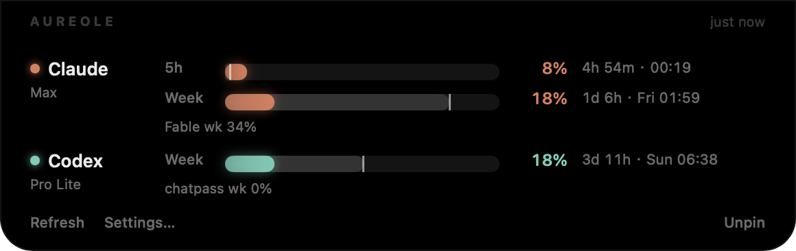

# Aureole

**Your AI coding quotas, as a halo around the MacBook notch.**

Aureole is a small native macOS app that shows how much of your Claude and Codex subscription
you have left, right where your eyes already are. Two arcs of light hug the notch: one per
provider, shrinking as the current window drains and lighting back up when it resets. Hover
to see the numbers.




## What it shows

- **5-hour session and weekly windows** for Claude (Claude Code sign-in) and Codex (Codex CLI sign-in),
  including per-model weekly limits when your plan has them.
- **Pace bars.** The faint layer is the clock (how much of the window has elapsed); the bright layer is
  your usage. Usage running ahead of the clock turns amber before you hit the wall.
- **Polite polling.** Once a minute while your numbers move, slowing to every five minutes when they don't; obeys `Retry-After` when a vendor asks for a pause, and shows the last known numbers meanwhile.
- **Reset times** as both a countdown and a clock time: `4h 37m · 00:00`.
- **Burn rate and forecast.** After a few minutes of samples: `≈12%/h · empty 14:12, before reset`.
- **Routing hint.** When one provider is nearly drained and the other has headroom, the panel says so.
- **Alerts where you actually are.** macOS notifications plus Discord, Slack, Telegram, Feishu/Lark,
  DingTalk, WeCom, ntfy, Bark, ServerChan (WeChat), a custom JSON webhook, or a shell script.
  Events: warn / critical thresholds, window reset, "runs out before reset" forecast, sign-in lost.
- **Solid black or Liquid Glass** panel background (Liquid Glass on macOS 26, a frosted material on older systems); the band that meets the hardware notch always stays black.
- **English and 简体中文**, switchable in Settings (follows the system language by default).
- Works without a notch too: on external displays it draws a pill at the top of the screen, and
  there is always a menu bar item.

## Install

Requires macOS 14 or later. Apple silicon and Intel.

```bash
git clone https://github.com/qianqianob/aureole.git
cd aureole
scripts/build-app.sh          # → build/Aureole.app
open build/Aureole.app
```

Builds are ad-hoc signed for now, so the first launch needs a right-click → Open. Signed and
notarized releases (and a Homebrew tap) will follow once the developer certificate is in place.

## How it reads your usage

Aureole reuses the sign-ins you already have. It never asks for passwords and never refreshes or
writes a token: refreshing would invalidate the copy Claude Code or Codex holds and force you to
log in again.

| Provider | Where the token comes from | What it calls |
|---|---|---|
| Claude | The `Claude Code-credentials` Keychain item written by `claude login` | `api.anthropic.com/api/oauth/usage` |
| Codex | `~/.codex/auth.json` written by `codex login` | `chatgpt.com/backend-api/wham/usage` |

By default the Claude token is read through `/usr/bin/security`, Apple's own signed binary, so the
one-time **Always Allow** you grant in the Keychain prompt survives rebuilds of Aureole. You can
switch to the direct Keychain API in Settings → Providers.

These are the same unofficial endpoints the vendors' own CLIs use. If a vendor changes them,
Aureole shows an error instead of a number until it is updated.

## Privacy

- No accounts, no telemetry, no analytics.
- Notification channel settings (webhook URLs, bot tokens) are stored in
  `~/Library/Application Support/Aureole/channels.json` with `0600` permissions.
- Usage samples for the burn-rate forecast live in `history.json` next to it, seven days deep.
- `defaults write app.aureole.Aureole debugDump -bool true` saves the raw usage payloads to
  `Application Support/Aureole/debug/` for bug reports. They contain usage numbers and, for Codex,
  your account id and email, never tokens. Off by default.

## Development

```bash
swift build            # library + app binary
swift test             # AureoleCore unit tests
scripts/run.sh         # debug build, relaunch
scripts/dev-cmd.sh open|close|refresh   # drive the running app for screenshots
```

Layout:

- `Sources/AureoleCore` — models, providers, decoders, burn-rate predictor, event detector,
  notification channels. Pure Foundation, unit-tested, reusable from a CLI.
- `Sources/Aureole` — the AppKit/SwiftUI app: notch geometry, the floating panel, views, settings.

Adding a provider means one type conforming to `UsageProvider` and one case in `ProviderID`.

## License

MIT. Aureole is not affiliated with Anthropic or OpenAI.
