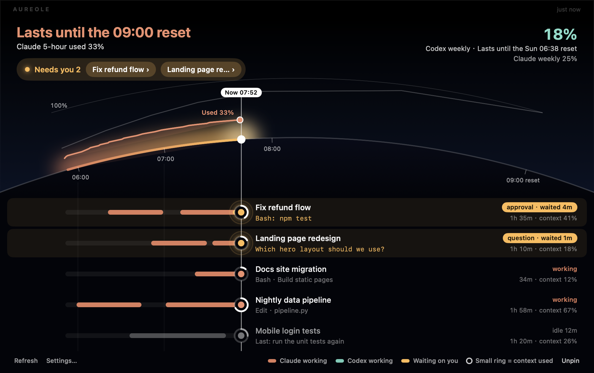

# Aureole

**Your AI coding quotas and agent sessions, in the MacBook notch.**

[简体中文](README.zh-CN.md)

Aureole is a small native macOS app that shows how much of your Claude and Codex subscription
you have left, and what each of your Claude Code sessions is doing, right where your eyes already
are. Closed, two arcs of light hug the notch, one per provider, shrinking as the current window
drains. Hover, and the panel drops down:




**How to read it.** Time runs left to right along the edge of a planet, with **now** at the white
sun.

- **The arc is your quota.** The orange curve rising off the horizon is how much of the current
  window you have used; the dashed line is where the current pace takes you; the faint line is
  the steady pace that would land exactly on 100% at the reset. If the forecast hits 100% early,
  the title turns amber (**Runs out 21:35**, *2h 45m before the 00:20 reset*) and the stretch with no
  quota left is shaded.
- **Each lane below is one session**, on the same clock. Left of the now line: when it was working
  (orange) or waiting on you (amber) over the past two hours. On the now line: its light, with a
  small ring for how full its context is. Right of it: its name, what it is doing or asking, how
  long it has been running, and its context size.
- **Sessions waiting on you come first**, highlighted, with how long they have waited. Click any
  lane to jump to its terminal tab. Many sessions? The lanes scroll.

## What it shows

- **5-hour session and weekly windows** for Claude (Claude Code sign-in) and Codex (Codex CLI sign-in),
  including per-model weekly limits when your plan has them.
- **Sessions.** Every Claude Code session, waiting / done / working / idle, on one screen (see below).
- **It calls you.** The closed notch shows "● Waiting 2 · ✓ Done 1" when a session needs you, and a
  session waiting for minutes or a finished task is announced through your notification channels.
- **Weekly forecast** from the week's average pace: "Claude weekly 40% · runs out Thu 15:00".
- **A plain layout too.** Settings → Panel layout → List swaps the picture for pace bars and a task
  list in a narrower panel.
- **Polite polling.** Once a minute while your numbers move, slowing to every five minutes when they don't; obeys `Retry-After` when a vendor asks for a pause, and shows the last known numbers meanwhile.
- **Reset times** as both a countdown and a clock time: `4h 37m · 00:00`.
- **Burn rate and forecast.** After a few minutes of samples: `≈12%/h · empty 14:12, before reset`.
- **Routing hint.** When one provider is nearly drained and the other has headroom, the panel says so.
- **Alerts where you actually are.** macOS notifications plus Discord, Slack, Telegram, Feishu/Lark,
  DingTalk, WeCom, ntfy, Bark, ServerChan (WeChat), a custom JSON webhook, or a shell script.
  Events: warn / critical thresholds, window reset, "runs out before reset" forecast, sign-in lost.
- **Solid black or Liquid Glass** panel background (Liquid Glass on macOS 26, a frosted material on older systems); the band that meets the hardware notch always stays black.
- **English and 简体中文**, switchable in Settings (follows the system language by default).
- Works without a notch too: on external displays it draws a pill at the top of the screen, and
  there is always a menu bar item.

## Install

Requires macOS 14 or later on Apple silicon. A universal build for Intel compiles with
`UNIVERSAL=1 scripts/build-app.sh` but has not been tested on Intel hardware.

### Build from source

```bash
git clone https://github.com/xiyoushiguang/aureole.git
cd aureole
scripts/build-app.sh          # → build/Aureole.app
open build/Aureole.app
```

An app you build yourself is not quarantined, so it opens directly.

### Download a release

Grab `Aureole-<version>.dmg` from the Releases page and drag Aureole to Applications.

Releases from 0.4.0 on are signed with a Developer ID and notarized by Apple, so they open like any
other app. (0.3.0 and earlier were not: if you still have one, macOS 15 needs **System Settings →
Privacy & Security → Open Anyway** once.) A Homebrew tap may follow.

### Updating

When a new release is out, the panel footer says **Update to x.y.z ›**. A click downloads the disk
image from GitHub, checks that it is signed by the same developer and passes Gatekeeper, moves the old
copy to the Trash, puts the new one in its place and reopens Aureole. If any check fails, nothing is
replaced and the release page opens instead.

### Uninstalling

Use **Settings → General → Uninstall Aureole…**. It removes Aureole's hooks from
`~/.claude/settings.json` and `~/.codex/hooks.json`, puts back the status line you had before, turns off
launch at login, and moves Aureole's data, logs and the app to the Trash. Your other hooks are kept.

If you already deleted the app, clean up by hand: remove every hook entry whose command contains
`aureole-hook` from `~/.claude/settings.json` and `~/.codex/hooks.json`; if `statusLine` points at
`aureole-hook --statusline`, restore it from `~/Library/Application Support/Aureole/statusline-chain.json`
(or delete it); then delete `~/Library/Application Support/Aureole` and `~/Library/Logs/Aureole`.
Aureole made a one-time backup of each file it edited next to it (`*.bak-aureole`).

## How it reads your usage

Aureole reuses the sign-ins you already have. It never asks for passwords and never refreshes or
writes a token: refreshing would invalidate the copy Claude Code or Codex holds and force you to
log in again.

| Provider | Where the token comes from | What it calls |
|---|---|---|
| Claude | The `Claude Code-credentials` Keychain item written by `claude login` | `api.anthropic.com/api/oauth/usage` |
| Codex | `~/.codex/auth.json` written by `codex login` | `chatgpt.com/backend-api/wham/usage` |

**Optional, and lighter:** Settings → Sessions → *Usage from the status line*. Claude Code hands its
status line command the 5-hour and weekly numbers (Pro and Max plans) and each session's exact context
use. With this on, Aureole takes them from there and calls the endpoint only every ten minutes, for the
per-model windows the status line does not carry. If you already have a status line, it keeps running:
Aureole saves its setting, runs it, prints its output, and puts it back when you remove the feature.

By default the Claude token is read through `/usr/bin/security`, Apple's own signed binary, so the
one-time **Always Allow** you grant in the Keychain prompt survives rebuilds of Aureole. You can
switch to the direct Keychain API in Settings → Providers.

These are the same unofficial endpoints the vendors' own CLIs use. If a vendor changes them,
Aureole shows an error instead of a number until it is updated.

## Sessions

Session lanes need a one-time setup: **Settings → Sessions → Install hooks**. That registers a
small helper (`aureole-hook`) in `~/.claude/settings.json` for eight hook events, keeping any hooks
you already have. Sessions are named by the title Claude Code or Codex gives the conversation; until
there is one, by the first line of your first prompt; two sessions that would read the same get "· 2".

**Background runs** (`claude -p`, `codex exec`, or anything started with neither a terminal nor an app
above it, such as a cron job) are listed at the bottom, marked *Background*, and never notified.

**Notifications stay quiet when they would only repeat what you see:** nothing is sent while the
session's terminal or app is in front and you have used the Mac in the last minute. Hover a session and
click **Mute** to stop hearing about it; **Settings → General → Quiet hours** holds back every push
(macOS and channels) in the hours you pick. The panel always shows everything.

Sessions and the horizon panel arrived in v0.2.0.

Each session is one small file under `~/Library/Application Support/Aureole/sessions/` (mode 0600)
holding the folder, state, current tool, terminal id and an optional 80-character prompt excerpt
(switch it off in Settings). The title and context size are read from the tail of the session's
own transcript and kept in memory only. The helper prints nothing and exits 0, so it can never block or change
a session. Jumping to a Terminal or iTerm2 tab uses Apple Events; macOS asks once (the panel
keeps working while it waits for your answer).

### Jumping to the terminal

| Where the session runs | Click takes you to |
|---|---|
| Terminal, iTerm2 | the exact tab (Apple Events; macOS asks once) |
| tmux (inside any of these) | the exact pane |
| WezTerm | the exact pane (`wezterm cli activate-pane`) |
| kitty | the exact window, if `allow_remote_control` and `listen_on` are set in kitty.conf |
| Ghostty 1.3+ | the tab whose working directory matches (AppleScript) |
| VS Code, Cursor | the window with that folder open (their integrated terminals cannot be picked from outside) |
| Warp, Alacritty, Codex desktop | the app comes to the front |

Only Terminal and iTerm2 have been tested on real hardware so far; reports for the others are welcome.

### Approving from the panel (opt-in)

Settings → Sessions → *Approve requests from the panel*. When a session asks for permission, hover it:
the card shows the full request (the whole command, or the file and the change) with **Allow once**
and **Deny**. Nothing is allowed without that click, and there is no "always allow". While Aureole
waits (15, 30 or 60 seconds, your choice) the terminal prompt is held back; if you do not answer, it
appears as usual. Works for Claude Code and Codex.

When Claude asks you a question (its multiple-choice prompt), the same card shows the options: pick one
(or several, where allowed) and **Send answer**. Claude Code only.

## Privacy

- No accounts, no telemetry, no analytics.
- **Settings → General → Copy diagnostics** puts versions, install state and recent errors on the
  clipboard for a bug report. It leaves out tokens, prompts, session names and folders.
- Once a day Aureole asks GitHub's public API for the latest release (switch it off in Settings → General).
- Notification channel settings (webhook URLs, bot tokens) are stored in
  `~/Library/Application Support/Aureole/channels.json` with `0600` permissions.
- Usage samples for the burn-rate forecast live in `history.json` next to it, seven days deep.
- `defaults write app.aureole.Aureole debugDump -bool true` saves the raw usage payloads to
  `Application Support/Aureole/debug/` for bug reports. They contain usage numbers and, for Codex,
  your account id and email, never tokens. Off by default.

## Development

```bash
swift build            # library + app binary
swift test             # AureoleCore unit tests
scripts/run.sh         # debug build, relaunch
scripts/dev-cmd.sh open|close|refresh   # drive the running app for screenshots
```

Layout:

- `Sources/AureoleCore` — models, providers, decoders, burn-rate predictor, event detector,
  notification channels. Pure Foundation, unit-tested, reusable from a CLI.
- `Sources/AureoleCore/Horizon.swift` — the horizon's geometry and time mapping, tested on its own.
- `Sources/Aureole` — the AppKit/SwiftUI app: notch geometry, the floating panel, views, settings.

Adding a provider means one type conforming to `UsageProvider` and one case in `ProviderID`.

## Changelog

See [CHANGELOG.md](CHANGELOG.md).

## License

MIT. Aureole is not affiliated with Anthropic or OpenAI.
