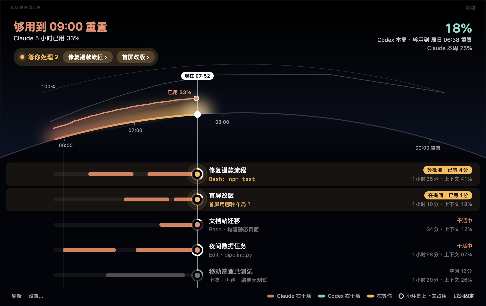

# Aureole

**把 AI 编程额度和 Agent 会话，放进 MacBook 的刘海里。**

[English](README.md)

Aureole 是一个原生 macOS 小工具：Claude 和 Codex 订阅还剩多少额度、每个 Claude Code 会话正在干什么，
都显示在你本来就会看的地方。收起时，刘海下沿是两道光弧，一家一道，额度用掉多少就缩短多少；
鼠标移上去，面板展开：




**怎么看。** 时间沿着一颗星球的地平线从左往右走，白色的太阳就是**现在**。

- **上面的弧讲额度。** 从地平线升起的橙色曲线是当前窗口已经用了多少；虚线是按现在的速度会走到哪；
  淡色的线是「匀速用完」——正好在重置时用到 100%。如果预测会提前用完，标题变成琥珀色
  （**21:35 用完**，*比 00:20 重置早 2 小时 45 分*），没有额度的那一段会被涂上颜色。
- **下面每一条横道是一个会话**，和弧共用同一根时间轴。「现在」竖线左边：过去两小时里它什么时候在干活（橙）、
  什么时候在等你（琥珀）；竖线上：它的状态光点，外圈小环是上下文占用；竖线右边：名字、正在做什么或在问你什么、
  开了多久、上下文多大。
- **等你处理的会话排在最前面**，高亮显示，并写明已经等了多久。点任意一条就跳到它所在的终端标签页。
  会话多了可以上下滑动。

## 能看到什么

- Claude（Claude Code 登录）和 Codex（Codex CLI 登录）的 **5 小时窗口和每周窗口**，套餐有分模型周额度时也会显示。
- **会话。** 所有 Claude Code 会话——等你处理 / 完成·未查看 / 干活中 / 空闲——一屏看完（见下文）。
- **会主动叫你。** 有会话等你或干完活时，收起的刘海下沿会显示「● 等你 2 · ✓ 完成 1」；等你超过几分钟、任务干完，都会通过你配置的渠道推送。
- **周额度预测**，按本周平均速度：「Claude 本周 40% · 周四 15:00 用完」。
- **也有朴素样式。** 设置 → 面板样式 → 列表：换成进度条加任务列表，面板更窄。
- **克制的刷新。** 数字在变时每分钟一次，不变时放慢到每五分钟；服务端要求暂停（`Retry-After`）时照做，期间显示最后一次的数字。
- **重置时间**同时给倒计时和钟点：`4小时37分 · 00:00`。
- **消耗速度和预测。** 采样几分钟后：`≈12%/小时 · 14:12 用完，早于重置`。
- **分流提示。** 一家快用完、另一家还很空时，面板会提醒你把新任务交给另一家。
- **在你在的地方提醒。** macOS 通知，以及 Discord、Slack、Telegram、飞书、钉钉、企业微信、ntfy、Bark、
  Server 酱（微信）、自定义 JSON webhook 或 shell 脚本。事件：警告 / 严重阈值、窗口重置、「重置前会用完」预测、登录失效。
- **纯黑或 Liquid Glass** 面板背景（macOS 26 上是 Liquid Glass，更早的系统是磨砂材质）；贴着刘海的那一条始终是黑色。
- **English 和简体中文**，设置里可切换（默认跟随系统）。
- 没有刘海也能用：外接显示器上会在屏幕顶部画一个胶囊，菜单栏里也始终有图标。

## 安装

需要 macOS 14 或更新版本、Apple 芯片。`UNIVERSAL=1 scripts/build-app.sh` 能编出 Intel 通用版，但没在 Intel 机器上测过。

### 从源码构建

```bash
git clone https://github.com/xiyoushiguang/aureole.git
cd aureole
scripts/build-app.sh          # → build/Aureole.app
open build/Aureole.app
```

自己编译的 app 不带隔离标记，可以直接打开。

### 下载发行版

从 Releases 页面下载 `Aureole-<版本>.dmg`，把 Aureole 拖进「应用程序」。

发行版目前是 ad-hoc 签名、未经公证，所以 macOS 会拦下第一次启动。macOS 15 及以后，右键 → 打开已经绕不过去：
先打开一次 Aureole，关掉警告，再去 **系统设置 → 隐私与安全性** 点 **仍要打开**。macOS 14 上右键 → 打开仍然有效。
等开发者证书到位后，会提供签名并公证的版本（以及 Homebrew tap）。

## 额度是怎么读到的

Aureole 复用你已经有的登录状态。它从不索要密码，也从不刷新或写入 token：刷新会让 Claude Code 或 Codex
手里的那份失效，逼你重新登录。

| 服务 | token 来自哪里 | 调用什么 |
|---|---|---|
| Claude | `claude login` 写入钥匙串的 `Claude Code-credentials` | `api.anthropic.com/api/oauth/usage` |
| Codex | `codex login` 写入的 `~/.codex/auth.json` | `chatgpt.com/backend-api/wham/usage` |

**可选、更轻的方式：** 设置 → 会话 → *从状态栏读取额度*。Claude Code 会把 5 小时、本周额度（Pro、Max 套餐）
和每个会话的准确上下文占用交给状态栏命令。开启后 Aureole 直接从那里取数，额度接口只每十分钟查一次，用来补状态栏不提供的分模型额度。
你原有的状态栏照常显示：Aureole 会保存它的设置、照常运行并显示它的输出，移除时原样放回。

默认通过 Apple 自己签名的 `/usr/bin/security` 读取 Claude token，所以你在钥匙串弹窗里点过一次「始终允许」，
重新编译 Aureole 后依然有效。也可以在 设置 → 服务商 里改成直接调用钥匙串 API。

这些是官方 CLI 自己在用的非公开接口。厂商一旦改动，Aureole 会显示错误而不是数字，直到更新适配。

## 会话

会话横道需要一次性设置：**设置 → 会话 → 安装 hooks**。它会在 `~/.claude/settings.json` 里为 8 个 hook 事件
登记一个小程序（`aureole-hook`），你原有的 hooks 原样保留。会话名用的是 Claude Code 给对话起的标题。

会话和晨昏线面板从 v0.2.0 开始提供。

每个会话在 `~/Library/Application Support/Aureole/sessions/` 下对应一个小文件（权限 0600），记录目录、状态、
当前工具、终端标识，以及可选的 80 字提示词摘录（可在设置里关掉）。标题和上下文大小从该会话自己的对话记录末尾读取，
只放在内存里。这个小程序不输出任何东西、总是以 0 退出，所以绝不会卡住或改变会话。跳到 Terminal 或 iTerm2
标签页用的是 Apple Events，macOS 会问一次（等你回答期间面板照常可用）。

### 点击跳转到哪里

| 会话运行在 | 点击后跳到 |
|---|---|
| Terminal、iTerm2 | 精确到那个标签页（Apple Events，macOS 会问一次） |
| tmux（在上述任意终端里） | 精确到那个窗格 |
| WezTerm | 精确到那个窗格（`wezterm cli activate-pane`） |
| kitty | 精确到那个窗口，前提是 kitty.conf 里开了 `allow_remote_control` 和 `listen_on` |
| Ghostty 1.3+ | 工作目录相同的那个标签页（AppleScript） |
| VS Code、Cursor | 打开了该文件夹的那个窗口（内置终端的具体标签页无法从外部选中） |
| Warp、Alacritty、Codex 桌面版 | 把 app 调到前面 |

目前只有 Terminal 和 iTerm2 在真机上测过，其他终端欢迎反馈。

## 隐私

- 没有账号，没有遥测，没有统计。
- 通知渠道设置（webhook 地址、机器人 token）存放在 `~/Library/Application Support/Aureole/channels.json`，权限 `0600`。
- 用于预测消耗速度的采样存在旁边的 `history.json`，保留七天。
- `defaults write app.aureole.Aureole debugDump -bool true` 会把原始额度返回存到 `Application Support/Aureole/debug/`
  便于报 bug。里面有用量数字，Codex 的还有账号 id 和邮箱，但从不包含 token。默认关闭。

## 开发

```bash
swift build            # 库 + app
swift test             # AureoleCore 单元测试
scripts/run.sh         # debug 构建并重启
scripts/dev-cmd.sh open|close|refresh   # 遥控正在运行的 app，方便截图
```

目录：

- `Sources/AureoleCore` —— 模型、各家额度读取、解码、消耗预测、事件检测、通知渠道。纯 Foundation，有单元测试，CLI 也能复用。
- `Sources/AureoleCore/Horizon.swift` —— 晨昏线的几何与时间映射，单独测试。
- `Sources/Aureole` —— AppKit/SwiftUI app：刘海几何、浮动面板、视图、设置。

新增一家服务只需要一个遵循 `UsageProvider` 的类型，加上 `ProviderID` 里的一个 case。

## 更新日志

见 [CHANGELOG.md](CHANGELOG.md)。

## 许可

MIT。Aureole 与 Anthropic、OpenAI 均无关联。
